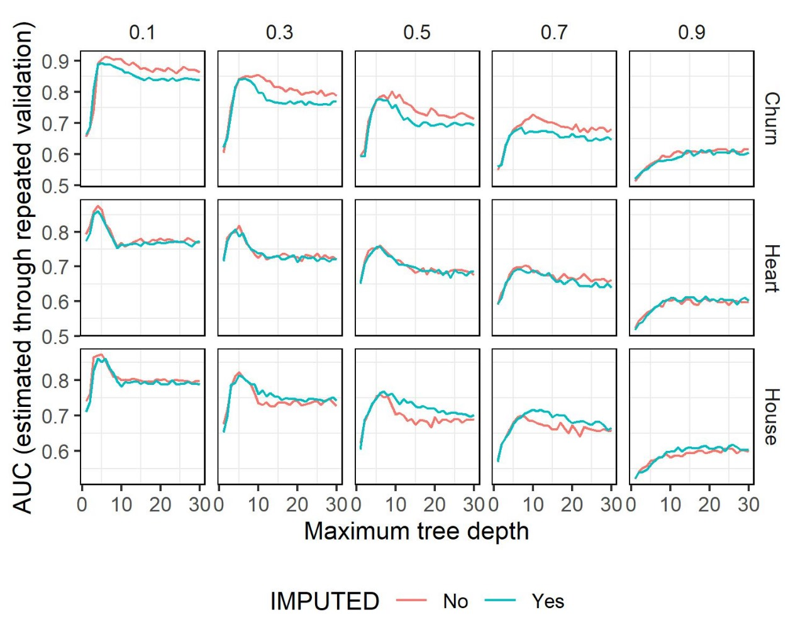

---
---
---

# **Ejercicio 2.1**

Ya realizado el experimento, tenemos los gráficos que analizaremos a continuación

## **Imputabilidad de los datos**

Churn Dataset: Vemos en los distintos gráficos la clara mejoría que ocurre al NO imputar los dartos que, si bien es leve y siguen las mismas tendencias, se diferencia claramente. Esto se puede deber a que nuestra estrategia para imputar los datos (promediar los no NAs), no es correcta o es peor a surrogate values que es el default de R. Igualmente vemos que siguen la misma tendencia según la flexibilidad del modelo.

Heart Dataset: En este conjunto de datos, en cambio, vemos que no existe una diferencia cuando realizamos una imputación de los datos y cuando no la realizamos. Uno de los motivos podría deberse a que la estrategia de imputación de datos es poco relevante para la predicción, podría ser dado que la solución default de R es igual de eficiente para este caso.

House Dataset: este dataset es el más variado. Por un lado, para los casos de pocos prop_NAs, hasta el de 0.15, vemos que no hay casi diferencia. Pero para los casos de mayores prop_NAs, se puede notar una pequeña diferencia en la cual el modelo tiene un leve mejor desempeño para los casos en los cuales se imputan los datos.

Para los tres modelos, más allá de lo mencionado, vemos que el AUC varía muy poco a la hora de imputar o no imputar los datos. Tenemos dos hipótesis respecto de por qué sucede esto: en primer lugar, que el método de imputación que utilizamos no agregue ningún sesgo o ruido al modelo y simplemente sean indiferentes que el método surrogate. Otra posible hipótesis que puede ser errónea dado no estamos seguros en si los datos faltantes del training luego se utilizan para calcular el AUC o no pero, podría ser que se esté generando un data leakage dado que quizás se está generando un oversampling o algún método similar que afecte directamente al AUC generando una falsa métrica.

**Flexibilidad del modelo**

Hasta el gráfico de 0.7, vemos que el pico de mejor AUC se encuentra en la profundidad 5 como máxima del árbol. Luego vemos que cae el modelo, por lo que se comenzaría a generar un overfitting del modelo. Esto sucede para los tres datasets. Luego en los gráficos de 0.9 en los que, ya el modelo no funciona bien de por sí, vemos que cuanto más flexible tiende a la mejora.

Por su parte, hay un underfitting muy marcado en Churn hasta la max depth de 5, dado que vemos como pasa de golpe de 0.6 a 0.9 aprox el AUC, para todos los prop_NAs hasta 0.7. Luego en prop_NAs de 0.9, es la excepción, dado que si bien arranca muy bajo, tampoco pega un gran salto en 5 nodos máx de profundidad. En el dataset de Heart y House ocurren las mismas tendencias. En 0.1 de prop_NAs, vemos que no hay un underfitting muy marcado, dado que comienza en 0.8 de AUC. En prop_NAs de 0.3 y 0.5, ocurre que arranca el AUC en 0.7 y 0.65 para poca flexibilidad y, vemos que ambos aumentan 1.5 puntos de AUC cuando para a 5 nodos. La excepción al igual que en Churn ocurre para prop_NAs en 0.9 dado que, arranca muy mal y mejora muy poco pero a más flexibilidad siempre sigue tendiendo a la mejora como previamente mencionamos.

Por lo que podemos concluir que el número ideal de máximos nodos para ambos datastets es de 5 nodos máx.

Nuestra hipótesis de por qué podría estar sucediendo esto es que a mayor flexibilidad se generará un overfiting en el cual, el modelo capta variables que no afectan a la variable a predecir lo que nos empeoraría el desempeño.

## **Proporción de NAs**

Para los 3 datasets, vemos que hay siempre una pérdida del promedio del AUC a medida que aumenta la proporción de NAs. Más allá de esto, con un prop_NAs de 0.5 se puede lograr un buen modelo con un AUC de 0.8 tanto si imputamos como si no loa datos con profundidad de 5 nodos máx para Churn y House y, un AUC de aprox 0.75 tanto si imputamos como si no, con profundidad de 5 nodos máx para Heart.

La hipótesis que pensamos es que a menor cantidad de datos, menor evidencia habrá sobre la correlación de las variables de nuestros datasets con la variable a predecir, generando caminos en el árbol de decisión con una precisión menor y provocando un peor AUC. Por su parte, hasta un prop_NAs de 0.5 vemos que tampoco es tan malo. Para este caso, nuestra hipótesis es que podría estar tratándose de un dataset muy grande en el cual, incluso teniendo la mitad de datos es suficiente para tener evidencia de cómo predecir ciertos valores.
