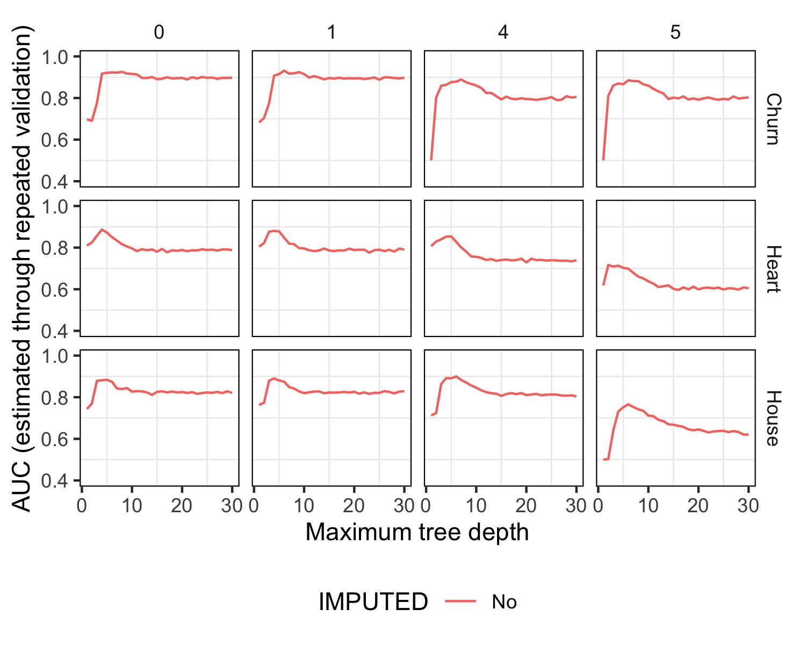

# **Experimento Propio**

**Objetivo:** Medir qué tan bueno es el modelo según la flexibilidad que le damos, a medida que eliminamos las variables menos importantes.

**Hipótesis:** Eliminar las variables menos importantes no afectará mucho en el AUC de nuestro modelo, salvo que sean muy pocas las variables que conforman al dataset en su integridad.

**Implementación:** Para realizar el experimento, creamos una función eliminar_columnas_menos_importantes que elimina las columnas menos importantes según el hiperparámetro que pasemos como instancia, devolviendo la lista modificada que también pasamos como instancia. Luego corremos el experimento sin imputar datos ya que como vimos en el exp_1 no afecta mucho al desempeño de ninguno de nuestros datasets. Luego corrimos el experimento aumentando la flexibilidad y eliminando primero 0 columnas, luego 1, luego 4 y luego 5, esos datos aparecen arriba de todo en la imagen a continuación.

## Resultados:

Aquí tenemos los resultados de los experimentos. Como bien dijimos en la hipótesis, eliminar las columnas menos importantes no afecta al AUC de nuestro modelo de predicción, de hecho, se mantienen practicamente igual cuando eliminamos las menos importantes.

En churn, podemos ver un empeoramiento cuando se eliminan las 4 columnas menos importantes pero que retoma cuando llega a 5 nodos máx de árbol, y ese desempeño que se mantiene cuando eliminamos 5 columnas. Esto podría deberse a que el dataset tiene muchas columnas las cuales no aportan mucha información relevante a la hora de predecir el churn rate de los clientes. Vemos que aún eliminando 5 variables el modelo mantiene métricas muy similares que con el dataset completo.

Por su parte, el dataset Heart, mantiene su AUC eliminando la cuarta columna menos importante inclusive, pero vemos cómo empeora el modelo cuando eliminamos la quinta. Aquí suponemos que el dataset de por sí, tiene 4 columnas que no nos están aportando en la mejoría de nuestra predicción. Ahora bien, cuando intentamos eliminar la quinta, resulta que nos afecta al modelo dado que se estaría tratando de una variable con alta importancia. Exactamente lo mismo sucede para el dataset House.

En conclusión, la eliminación de columnas podría mejorar el desempeño en términos de eficiencia de nuestro modelo. Si bien no vimos mejorías eliminando variables, hubo casos donde no vimos que empeorara el modelo. Y suponemos que al tener menos datos que procesar el modelo funcionará más rápido. Pero podría sucedernos, como en los casos donde eliminamos 5 columnas y la performance decayó, que afecte al desempeño y nos veamos perjudicados con nuestras predicciones. Por lo que para eliminar columnas de manera adecuada, dependerá de cada caso particular cuántas podríamos eliminar para mejorar la eficiencia del modelo.

Por lo que siguiendo la línea de nuestra hipótesis, podríamos agregar que ante una buena selección de variables, podríamos eliminarlas sin afectar el desempeño de nuestro modelo y a su vez, creemos que esto mejoraría la eficiencia porque al tener menor cantidad de datos, tendremos menos procesamiento de ellos, por lo menos, menor tiempo requerido. Otra hipótesis: esto en práctica en tiempo real, podría darnos una gran ventaja. Teniendo un modelo que precise entrenarse constantemente y requiramos velocidad por X motivo, ya sea para competir contra otra empresa o lo que fuere, esta práctica de eliminar columnas no tan relevantes podría ser de gran valor.
